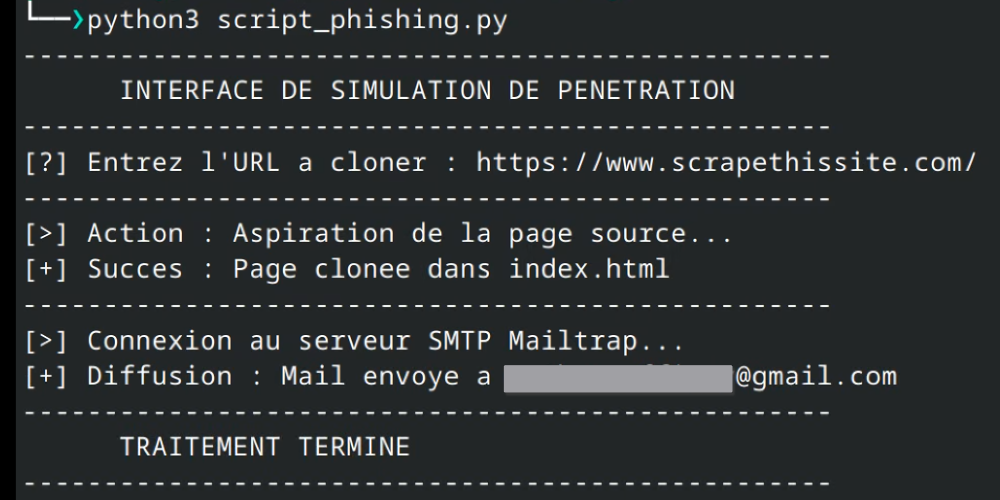
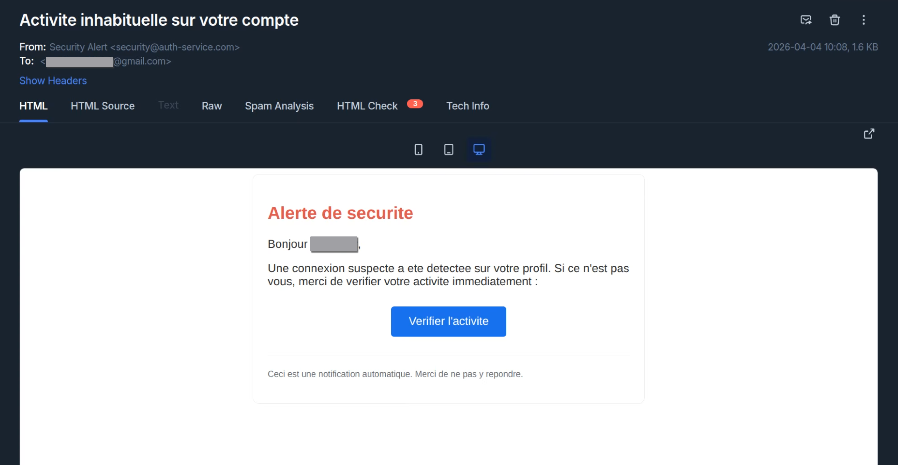
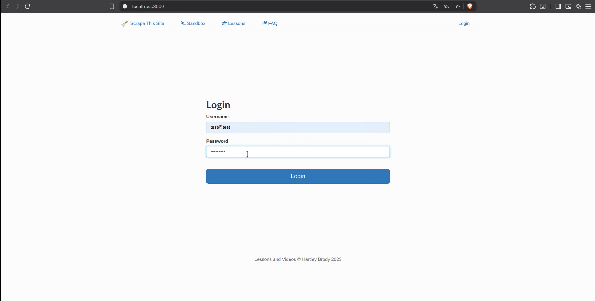
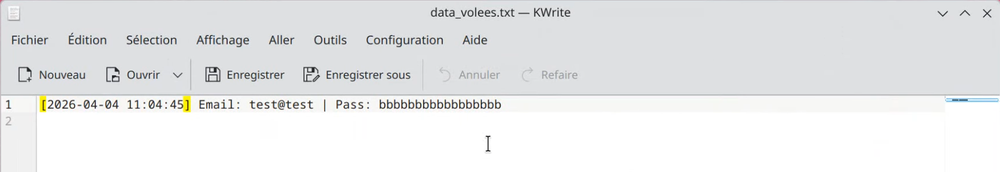

# Simulation de campagne de Phishing

> ⚠️ **Avertissement légal** : Ce projet a été réalisé 
> dans un cadre strictement éducatif, en environnement 
> isolé, sur des cibles fictives. 
> Toute reproduction sur des cibles réelles sans 
> consentement explicite est illégale (Art. 323-3-1 
> du Code pénal français).

##  Contexte

Ce projet illustre avec quelle facilité une attaque de 
phishing ciblée peut être montée, avec des outils 
accessibles et sans compétences avancées.

L'objectif est de **sensibiliser** aux risques réels 
de ce type d'attaque, souvent sous-estimée car elle 
ne repose sur aucune faille technique — uniquement 
sur la manipulation humaine.

##  Comment ça fonctionne

### 1.  Liste de cibles
Il suffit d'un fichier Excel contenant les noms, prénoms 
et adresses email des cibles. Le script lit automatiquement 
ces informations pour personnaliser chaque email envoyé.

### 2.  Clonage automatique de page
En entrant simplement l'URL du site à imiter, le script 
récupère et reproduit automatiquement la page de connexion 
grâce à la librairie Python **BeautifulSoup**.  
Aucune retouche manuelle n'est nécessaire.

### 3.  Envoi d'emails ciblés et personnalisés
Les emails sont envoyés via **SMTP** en utilisant le prénom 
de la victime pour les rendre crédibles. L'expéditeur et 
l'objet sont conçus pour imiter une alerte de sécurité 
officielle et provoquer un sentiment d'urgence.

> 📌 Dans le cadre de cette simulation, les emails ont été 
> envoyés via **Mailtrap** (sandbox) afin de ne jamais 
> atteindre de vraies boîtes mail.

### 4.  Collecte des identifiants
Lorsque la victime saisit ses identifiants sur la fausse 
page, ceux-ci sont transmis en **POST** vers un serveur 
**local** (à des fins de test uniquement) et enregistrés, 
avant de rediriger l'utilisateur vers le vrai site — 
sans qu'il ne remarque quoi que ce soit.

## 📸 Démonstration

### Étape 1 - Lancement du script et clonage automatique
Le script demande l'URL cible, clone la page de connexion 
et envoie les emails en une seule exécution.

### Étape 2 - Email reçu par la cible
L'email reçu imite une alerte de sécurité 
officielle, avec le prénom de la victime et un bouton 
d'action incitant au clic immédiat.

### Étape 3 - Fausse page de connexion
En cliquant sur le lien, la victime arrive sur une copie 
visuelle fidèle du site ciblé, hébergée en local.  
On le voit a l'URL `localhost:8000`. 
Mais dans un cas réel, un domaine trompeur 
(ex: `auth-google-security.com`) peut etre facilement utilisé.

### Étape 4 - Identifiants collectés
Les identifiants saisis sont enregistrés silencieusement 
côté serveur. La victime est ensuite redirigée vers 
le vrai site, sans se douter de rien.

## 🛡️ Comment s'en protéger

| Bonne pratique | Pourquoi |
|---|---|
|  Vérifier l'URL avant de saisir ses identifiants | Un faux domaine peut être très proche du vrai |
|  Activer le 2FA | Un mot de passe volé seul ne suffit plus |
|  Ne jamais cliquer sur un lien dans un email d'alerte | Aller directement sur le site via le navigateur |
|  Utiliser un gestionnaire de mots de passe | Il ne remplira pas automatiquement sur un faux site |
|  Signaler les emails suspects | Alerter son service informatique immédiatement |

## ⚖️ Cadre légal

Ce projet a été réalisé :
- En **environnement isolé** (serveur local)
- Sur des **cibles fictives** uniquement
- Via une **sandbox email** (Mailtrap) sans envoi réel
- À des fins de **démonstration et sensibilisation** uniquement

*Projet réalisé dans le cadre d'une campagne de sensibilisation 
à la cybersécurité.*
